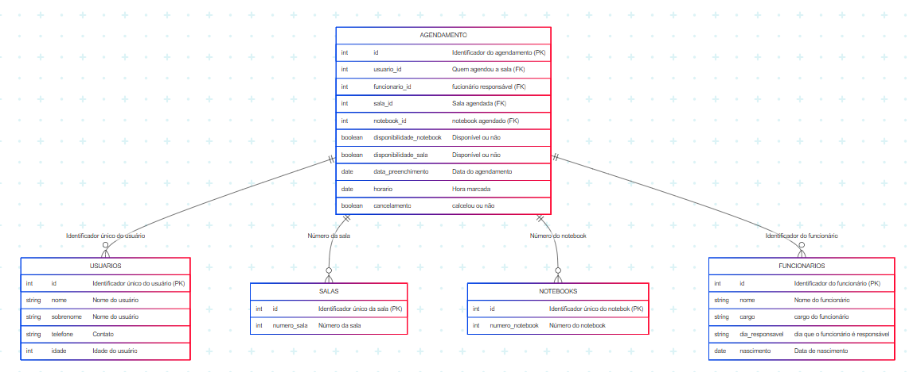
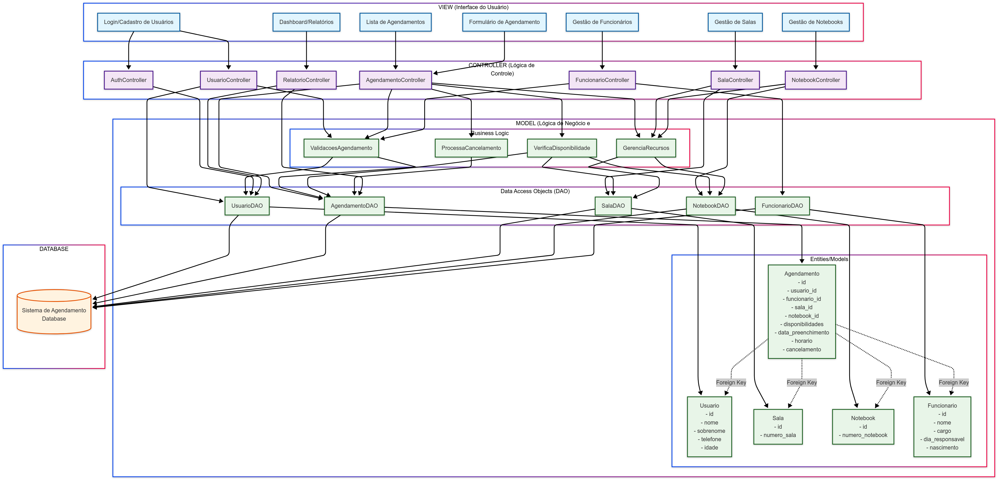
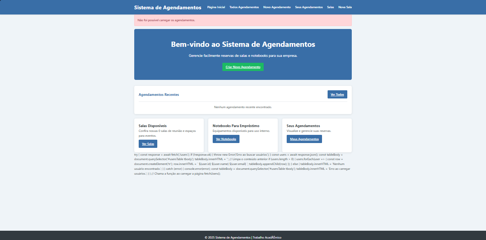
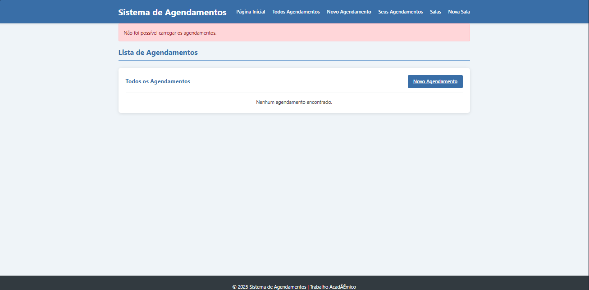
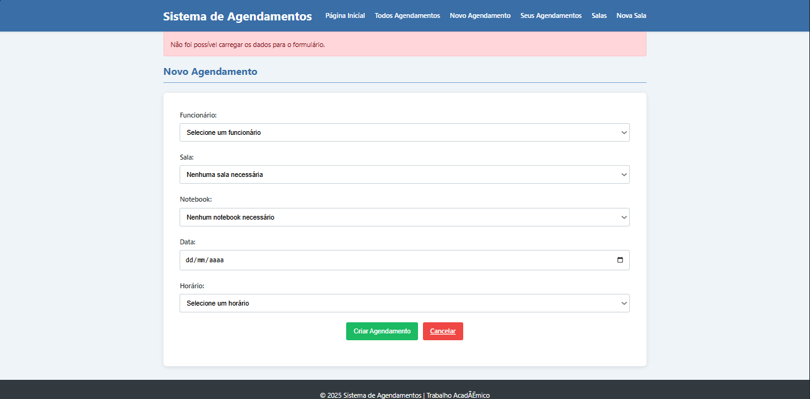
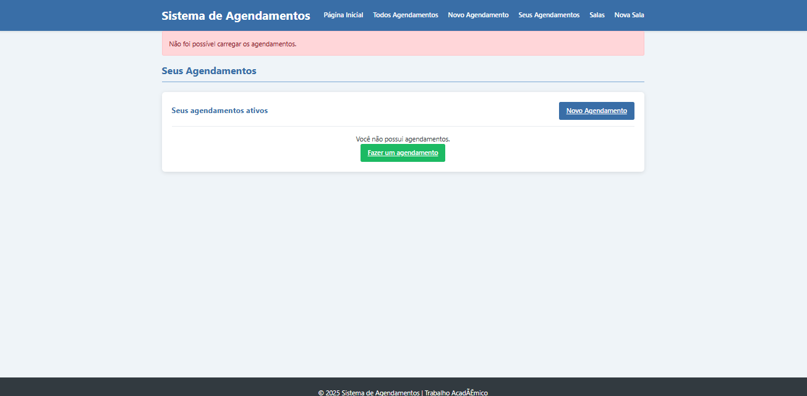
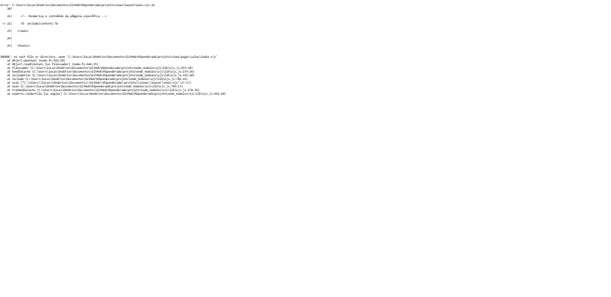

# Web Application Document - Projeto Individual - Módulo 2 - Inteli

> **Nota:** *Os trechos em itálico servem apenas como guia para o preenchimento da seção. Por esse motivo, não devem fazer parte da documentação final.*

---

## Nome do Projeto

#### Autor do projeto

---

## Sumário

1. [Introdução](#introducao)  
2. [Visão Geral da Aplicação Web](#visao-geral)  
3. [Projeto Técnico da Aplicação Web](#projeto-tecnico)  
4. [Desenvolvimento da Aplicação Web](#desenvolvimento)  
5. [Referências](#referencias)  

---

## <a name="introducao"></a>1. Introdução (Semana 01)

Estou desenvolvendo um sistema web para o agendamento de salas de estudos, nesse site você poderá agendar salas com notebooks, como o site não é voltado somente para os clientes nele também poderá fazer alterações como deletar funcionários, mudar os turnos de trabalhos deles e mudar os cargos deles caso recebam uma promoção.

---

## <a name="visao-geral"></a>2. Visão Geral da Aplicação Web

### 2.1. Personas (Semana 01 - opcional)

*Posicione aqui sua(s) Persona(s) em forma de texto markdown com imagens, ou como imagem de template preenchido. Atualize esta seção ao longo do módulo se necessário.*

### 2.2. User Stories (Semana 01 - opcional)

*Posicione aqui a lista de User Stories levantadas para o projeto.*  
*Siga o template de User Stories e utilize a referência USXX para numeração (US01, US02, US03, ...).*  
*Explique o INVEST de uma User Story prioritária.*

---

## <a name="\projeto-tecnico"></a>3. Projeto da Aplicação Web

### 3.1. Modelagem do banco de dados (Semana 03)



**Explicação do Banco de Dados:**
Este banco de dados foi projetado para gerenciar o agendamento de salas e notebooks por usuários, com o suporte de funcionários responsáveis. Abaixo estão as tabelas e seus papéis:


**`USUARIOS`:**
Armazena informações das pessoas que utilizam o sistema para agendar salas e notebooks.

**Campos principais:** `id`: Identificador único (chave primária), `nome`, `sobrenome`, `telefone`, `idade`


**`SALAS`:**
Contém os dados das salas que podem ser reservadas.

**Campos principais:** `id`: Identificador da sala, `numero_sala`: Número da sala física


**`NOTEBOOKS`:**
Registra os notebooks disponíveis para empréstimo ou uso em agendamentos.

**Campos principais:** `id`: Identificador do notebook, `numero_notebook`: Número de controle interno


**`FUNCIONARIOS`:**
Lista os funcionários responsáveis pelos agendamentos.

**Campos principais:**
`id`: Identificador do funcionário, `nome`, `cargo`, `dia_responsavel`, `nascimento`


**`AGENDAMENTO`:**
Tabela central do sistema. Registra cada agendamento realizado.

**Campos principais:**

`id`: Identificador do agendamento, `usuario_id`: Quem agendou (FK para `USUARIOS`), `funcionario_id`: Responsável pelo agendamento (FK para `FUNCIONARIOS`), `sala_id`: Sala reservada (FK para `SALAS`), `notebook_id`: Notebook reservado (FK para `NOTEBOOKS`), `disponibilidade_sala` e `disponibilidade_notebook`: Indicadores booleanos de disponibilidade, `data_preenchimento`, `horario`, `cancelamento`


**Relacionamentos**

A tabela `AGENDAMENTO` conecta todas as outras:
- Cada agendamento envolve um **usuário**, **funcionário**, **sala** e **notebook**.
- As **chaves estrangeiras** garantem a integridade entre os dados.

Esse modelo garante um controle completo e integrado de agendamentos, recursos e usuários.

```sql
-- Tabela de usuários
CREATE TABLE USUARIOS (
    id INT PRIMARY KEY,
    nome VARCHAR(100),
    sobrenome VARCHAR(100),
    telefone VARCHAR(20),
    idade INT
);

-- Tabela de salas
CREATE TABLE SALAS (
    id INT PRIMARY KEY,
    numero_sala INT
);

-- Tabela de notebooks
CREATE TABLE NOTEBOOKS (
    id INT PRIMARY KEY,
    numero_notebook INT
);

-- Tabela de funcionários
CREATE TABLE FUNCIONARIOS (
    id INT PRIMARY KEY,
    nome VARCHAR(100),
    cargo VARCHAR(50),
    dia_responsavel VARCHAR(20),
    nascimento DATE
);

-- Tabela de agendamentos
CREATE TABLE AGENDAMENTO (
    id INT PRIMARY KEY,
    usuario_id INT,
    funcionario_id INT,
    sala_id INT,
    notebook_id INT,
    disponibilidade_notebook BOOLEAN,
    disponibilidade_sala BOOLEAN,
    data_preenchimento DATE,
    horario TIME,
    cancelamento BOOLEAN,
    FOREIGN KEY (usuario_id) REFERENCES USUARIOS(id),
    FOREIGN KEY (funcionario_id) REFERENCES FUNCIONARIOS(id),
    FOREIGN KEY (sala_id) REFERENCES SALAS(id),
    FOREIGN KEY (notebook_id) REFERENCES NOTEBOOKS(id)
);
```

### 3.2. Diagrama de arquitetura:



### Como iniciar o projeto:
1- Crie o arquivo .env
2- Preencha as informações:
DB_HOST=
DB_PORT=
DB_USER=
DB_PASSWORD=
DB_NAME=
3- Para fazer alterações no banco de dados deve-se ir no arquivo init.sql e fazer as alterações e rodar o comando npm run init-db
4- Para testar as APIs é preciso de um programa externo use o Postman para testes manuais e Jest/Supertest para testes automatizados.

### Prints das Views

1-Home Page


2-Lista de agendamentos


3-Novo Agendamento


4-Seus Agendamentos


5-Salas (dando erro)


6-Nova Sala


### Link para um vídeo de demosntração do site

### Tecnologias Utilizadas
1-SupaBase
2-Node
3-JavaScript
4-HTML
5-CSS
6-EJS

### Relatos
Foi um grande desafio desenvolver esse projeto, precisei de muita ajuda principalmente dos veteranos (obrigado Riciopo), integrar o front-end com o back-end foi um desafio enorme e que não consegui superar completamente. Agora falando um pouco sobre as facilidades, condegui compreender de forma bem consistente a parte do back-end e acredito que estou sabendo relativamente bastante considerando o tempo de estudo.

### Feedbacks
Compreendo que faz parte da metodologia do inteli, porém a falta de aulas mais teóricas faz com que o desenvolvimento do site seja muito mais demorado e complexo, acho que a ideia de deixar os alunos desenvolverem seu próprio site é muito ineteressante porém acho que poderia ter sido melhor planejada.